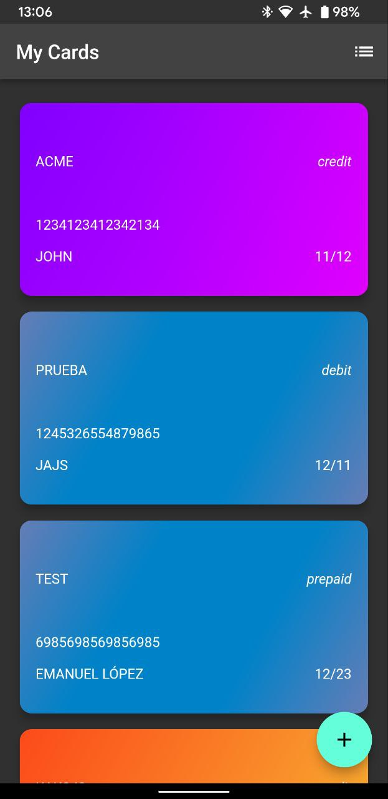
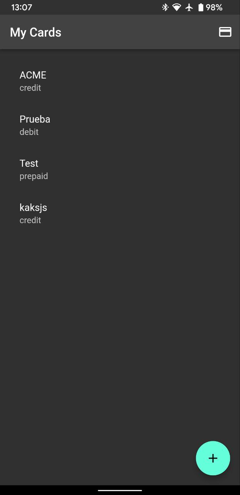
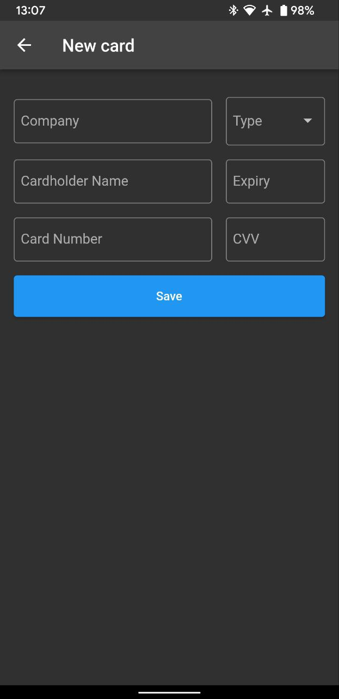

# flutter-credit-card-wallet

**This is a Work in progress.**

The purpose of this app is to store all my debit and credit cards data to have them available at any time.

I'm currently using Mercado Pago and YPF's app as my default wallets for paying stuff and, usually, it asks me for the CVC code of a particular card before finalizing the payment.

Having this data stored in my mobile allows me to continue using my cards without carrying them all the time with me.

## Security measurements
- All the data is stored encrypted in the local storage using AES encryption
- It's planned that the app will request the key for the AES encryption on the first run so each user has unique keys
- The app doesn't require internet access at all.
- App screenshots and app switcher preview will be disabled in the final release
- Card data will be visible one at a time. It won't be possible to see all the information at once
- The app will report if it detects that it is running on a rooted device

## Screenshots

Main screen (cards) | Main screen (list) | New card screen
--- | --- | ---
 |  | 
